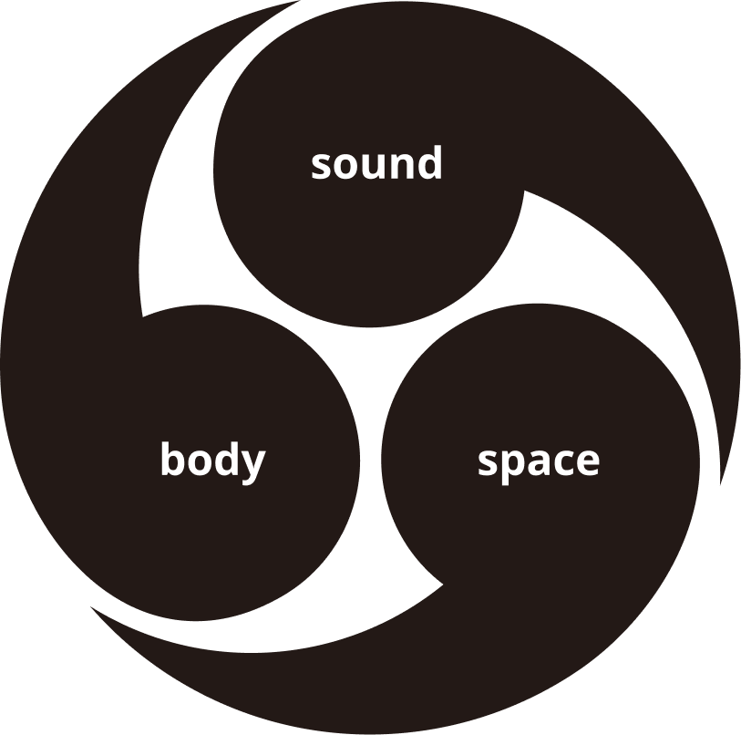
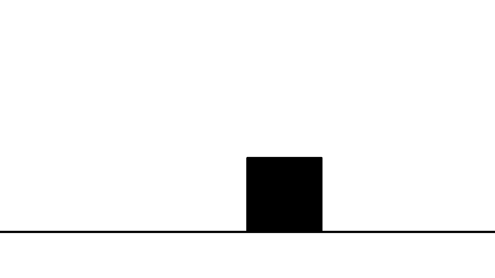
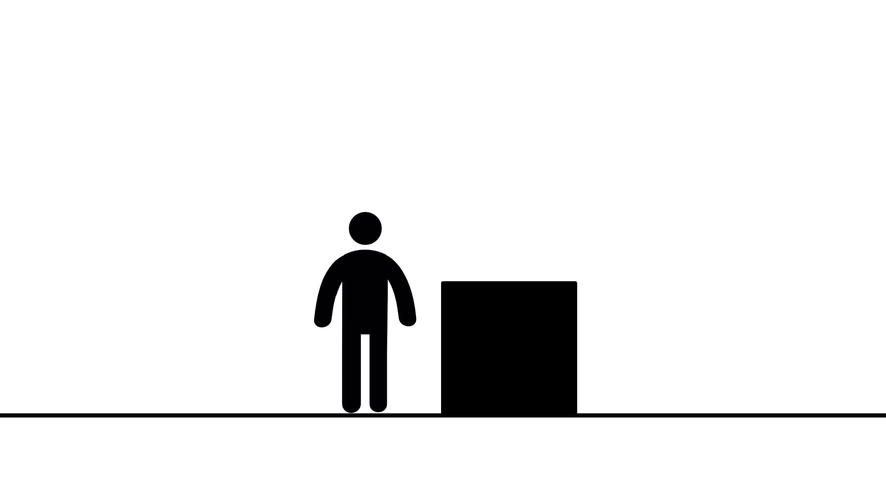
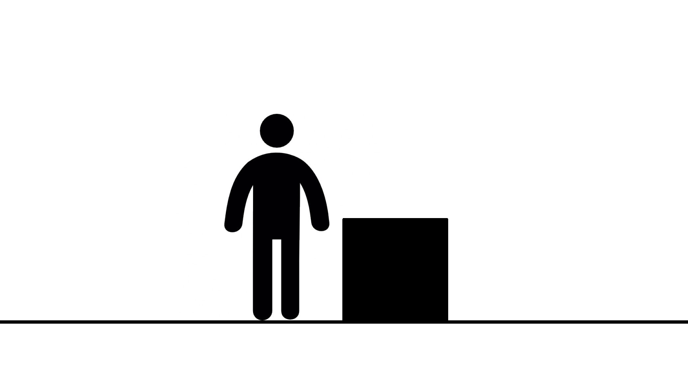
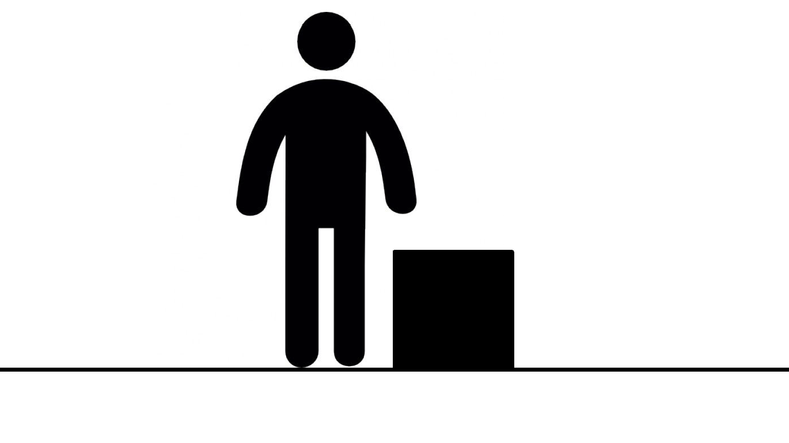
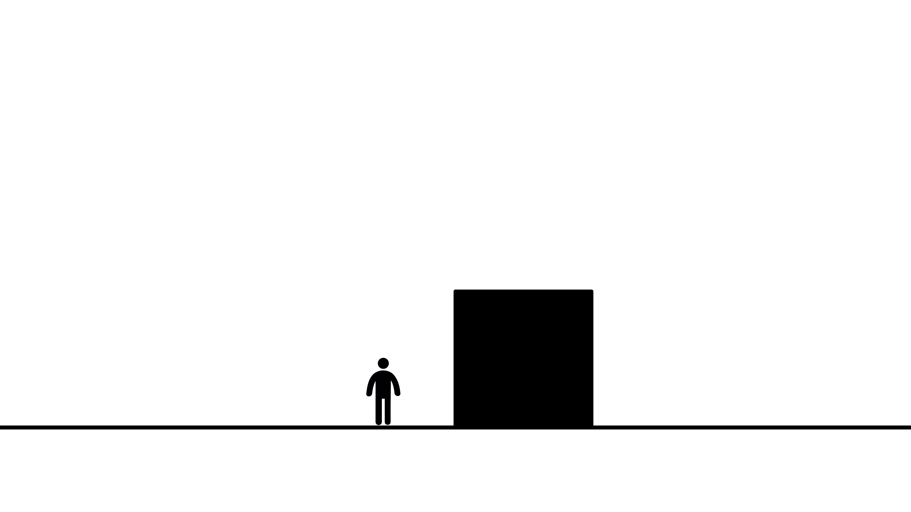
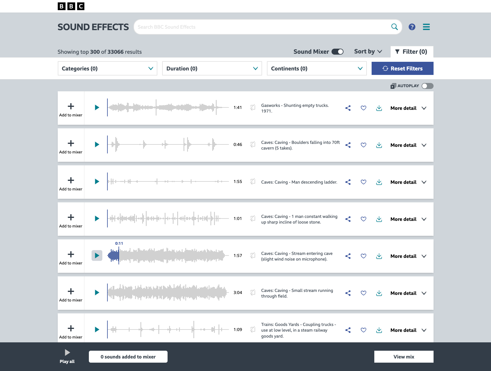

<link rel="stylesheet" href="../assets/css/slidetemplate2.css">

<link rel="preconnect" href="https://fonts.googleapis.com">
<link rel="preconnect" href="https://fonts.gstatic.com" crossorigin>
<link href="https://fonts.googleapis.com/css2?family=Nunito:wght@200;500;700&family=Roboto:ital,wght@0,100;0,300;0,400;0,500;0,700;1,100&display=swap" rel="stylesheet">

<!-- _class: lead -->
# Sound, Space, and Body (SSB)

---

## Today's Agenda

- Sound → Body: Deep Listening
- Sound, Space, and Body Studio Introduction
- Body → Sound: Sound Device

---

# Deep Listening Exercise

---
# R. MURRAY SCHAFER: LISTEN | Full Documentary | National Film Board of Canada

<iframe width="560" height="315" src="https://www.youtube.com/embed/rOlxuXHWfHw?si=b2LzB1vA192hUu3L" title="YouTube video player" frameborder="0" allow="accelerometer; autoplay; clipboard-write; encrypted-media; gyroscope; picture-in-picture; web-share" referrerpolicy="strict-origin-when-cross-origin" allowfullscreen></iframe>

---

- Draw a line down the middle of the paper. 
- Write "Natural" on the left and "Man-made" on the right.
- Listen to the sounds and write down each sound you can recognise.
- Put a circle next to the sounds you find pleasant, and a cross next to the sounds you find unpleasant.

---

## Syllabus 
https://docs.google.com/document/d/18S5z8rOj0pO3qSjWyH1ZCr6BvKwTUynm/edit

---

In this studio, we will explore design opportunities in this technological landscape of our everyday sound environment. 

How can we critically and creatively leverage digital and AI technology to **design a new triadic relationship between sound, space, and our body**?

---
# Sound, Space, and Body Triadic relationship

---

# Design Space

---

<iframe width="768" height="432" src="https://miro.com/app/live-embed/uXjVH_hFk_k=/?embedMode=view_only_without_ui&moveToViewport=-4216,-1408,10310,5015&embedId=702798651677" frameborder="0" scrolling="no" allow="fullscreen; clipboard-read; clipboard-write" allowfullscreen></iframe>

---
<!-- ## [Syllabus](https://docs.google.com/document/d/18S5z8rOj0pO3qSjWyH1ZCr6BvKwTUynm/edit) -->

Expected outcomes may be **products, apps, or installations dealing with intersections of sound, space and body**. Application areas can be new musical instruments, performance training, music education, relaxation, accessible listening experience, or visualization of urban and nature soundscape. 

---
<!-- ## [Syllabus](https://docs.google.com/document/d/18S5z8rOj0pO3qSjWyH1ZCr6BvKwTUynm/edit) -->

Since this is an individual project, **a key part of the process is defining a unique design focus based on your interests** within the vast field of sound design.

---
# Deliverables

> Keep in mind that it is an individual platform project.

1. Video documentation of the sonic experience 
2. A proof-of-concept prototype (a wizard-of-oz prototype is acceptable) 
3. Process documentation and reflection

---
# Timeline

**W1–W6: Explore & Frame & Decide**  
`- Recess Week -`
**W7–W10: Develop & Prototype & Test**  
**W11–W13: Document & Communicate**

<!-- A design studio project does not begin with a finished idea.

The process is about:
- expanding your field of interest,
- identifying a meaningful direction,
- testing possibilities through making,
- and gradually turning your exploration into a clear design proposal.

Think of the semester as three phases: -->
---
# Handson Projects

Two projects for enhancing basic sonic interaction design skills

- **Mini Project01: Interactive Sound Object**
  - Physical interactions between the body and sound
- **Mini Project02: Interactive Sound Environment**
  - Sound environment triggerd by the body movement

---

# Assessment Criteria

Mini Project01: Interactive Sound Object  10%
Mini Project02: Interactive Sound Environment 20%

Final-Project: 50%
Project Documentation: 20%

---

<!-- _class: lead -->

# Questions?

---
<!-- _class: lead -->
## Project approach

---

## 1. Define a broad field
Start with a larger territory that interests you.

Examples:
- sound and learning
- sound and public transportation
- sound and healthcare
- sound and social interaction
- sound and physical movement
---

## 2. Find Your Context

Narrowing down a topic by specifying the contexts, 

Try defining:

**WHO** — Who are you designing for or with?  
**WHERE** — In what place or situation?  
**WHAT** — What activity, behavior, or relationship interests you?

Then ask:

**Why** - Why is this interesting or important?

---
## Narrowing Down Contexts

**Broad Topic:** Sound and transportation  

**More specific:** Sound experience for commuters inside MRT stations

**Design question:** How might sound guide passengers to the correct MRT platform?

> To focus on purer sound experience design, art installations,  set museums or galleries as a spatial context.

---
# DID Project Archive

https://cde.nus.edu.sg/did/archive/?mode=&item=&gallery=platforms&filter=

---
# Mapping Sound, Space and Body 

---

# Human Echolocation
<iframe width="560" height="315" src="https://www.youtube.com/embed/sOTymNzS_gM?si=b2LzB1vA192hUu3L" title="YouTube video player" frameborder="0" allow="accelerometer; autoplay; clipboard-write; encrypted-media; gyroscope; picture-in-picture; web-share" referrerpolicy="strict-origin-when-cross-origin" allowfullscreen></iframe>

---

# Affordance

> The affordance of anything is  **a specific combination of the properties of its substance and its surfaces taken with reference to an animal.**  (Gibson 1979)

---
# Persian Carpet Pattern Singing

<iframe width="560" height="315" src="https://www.youtube.com/embed/vhgHJ6xiau8?si=7W6Qw47w1Dv_xLgL" title="YouTube video player" frameborder="0" allow="accelerometer; autoplay; clipboard-write; encrypted-media; gyroscope; picture-in-picture; web-share" referrerpolicy="strict-origin-when-cross-origin" allowfullscreen></iframe>

## your turn.
Please briefly explain "why" you became interested in three areas of interest and their examples, taking about 1 minute for each.

<!-- ---
# What we are not aiming for

- We don't teach music theory/music production
- We are not aiming to create a new music
    - How we can establish a new relationship with music?
- We are not aiming to create a new audio listening space
    - How we can establish a new relationship with sound in space?
- We are not aiming to create a new body -->

---
<!-- _class: lead -->

# Break

---

<!-- _class: lead -->

# Body → Sound: Sound Device

---

# How do bodily interactions relate to the perception of sound?

---

# Acoustic vs Digital Instrument
   - Trumpet vs Yamaha Digital Trumpet
   - Recorder vs Digital Wind Instrument

---
# Acoustic vs Digital Instrument

 Acoustic Instrument: Continuous and Integrated
 Digital Instrument: Discrete and Reconfigurable

---
# Patatap  https://patatap.com/

<iframe width="768" height="432" src="https://www.youtube.com/embed/m32Y75Hm_yU?si=p-nJq79T9uJgq-XK" title="YouTube video player" frameborder="0" allow="accelerometer; autoplay; clipboard-write; encrypted-media; gyroscope; picture-in-picture; web-share" referrerpolicy="strict-origin-when-cross-origin" allowfullscreen></iframe>

---
<!-- _class: lead -->

# Let's make a physical Patatap! 

---

# Materials

- micro:bit v2: https://www.microbit.org/
- p5.js: https://p5js.org/
- Bluetooth Speaker: 
  https://www.mi.com/global/product/xiaomi-bluetooth-speaker-essential/
- Sound files

---
## Signal Chain

INPUT: The micro:bit acts as a **Bluetooth keyboard**.

SOUND SOURCE: p5.js runs on a web browser (laptop/mobile).

OUTPUT: Bluetooth Speaker.

---
## Introduction to micro:bit 

<!-- https://app.notion.com/p/clementzheng/Introduction-to-Micro-bit-17eed8a3d6c381c99523e09bcfdbd652 -->
- Get-started with micro:bit:
https://microbit.org/get-started/features/overview/

- ID2116 AY23: https://app.notion.com/p/clementzheng/Introduction-to-Micro-bit-17eed8a3d6c381c99523e09bcfdbd652
---
## the micro:bit BLE HIDKeyboard Template
https://makecode.microbit.org/S63644-32563-56667-48169

<iframe style="position:absolute;top:0;left:0;width:100%;height:100%;" src="https://makecode.microbit.org/---codeembed#pub:S63644-32563-56667-48169" allowfullscreen="allowfullscreen" frameborder="0" sandbox="allow-scripts allow-same-origin"></iframe>

---

## Setup micro:bit BLE HID Keyboard Extension 

1. https://makecode.microbit.org → **New Project**
2. Extensions → paste
   `https://github.com/bsiever/microbit-pxt-blehid`
3. Gear → Project Settings →
   **"No Pairing Required: Anyone can connect via Bluetooth"**

**micro:bit v2 only.**

---

## Pairing

At boot your micro:bit scrolls **its own five-letter name**.
Write it down — thirty of them are advertising in this room.

- **iOS** Settings → Bluetooth → `uBit [name]`
- **macOS** System Settings → Bluetooth → Connect
- **Android** Settings → Connected devices → Pair new device

Test in any text field first: press A, see an `a`.

---
# Sound,Space and Body Sound Player

<iframe src="https://editor.p5js.org/didny/full/161-bRJ57"></iframe>

---

## [MiniProject 01] Interactive Sound Object 

Build a simple ~~percussive~~ responsive device that triggers sound through sensory inputs **to evoke a specific emotion.** Explore its sound, shape, and material combination.

#### Playtest in Week 4

---
# Sensor Misdirection (ID1115)

1. First, choose one sensor type (e.g. touch sensor)
2. Describe in verbs an action that the sensor can perceive (touch)
3. Rephrase that action using a different verb (stick)
4. Find an adjective associated with that verb (???)
5. Repeat for other sensor types (e.g. light sensor, motion sensor, etc.) and material combinations (e.g. metal, wood, water, etc.)
---
# Assignment 01: 3 Sound Interactions
# Sensor Misdirection 

1. First, choose one sensor type (e.g. touch sensor)
2. Describe in verbs an action that the sensor can perceive (touch)
3. Rephrase that action using a different verb (stick)
4. Find an adjective associated with that verb (???)
5. Repeat for other sensor types (e.g. light sensor, motion sensor, etc.) and material combinations (e.g. metal, wood, water, etc.)

---
1. Pick an object or a body part (e.g. a box, a door, a hand.)

1. List possible actions you can perform with it as verbs 
(e.g. open, shake, punch, squeeze.)

1. Identify which actions can be detected using the micro:bit and available sensors. (e.g. opening a box → light sensor)

1. Add an adjective that gives the action an emotional or expressive quality (e.g. joyful opening, nervous shaking, gentle knocking.)

1. Then design a sound response that expresses this quality and is triggered by the action.

1. Sketch the interaction, prototype it, and record a short video demonstrating how it works.

1. Create three clearly different interactions

You may vary the object, body part, action, sensor, sound response, or physical arrangement.

---

## How can we design sound sets??

---
# How This Woman Creates God of War’s Sound Effects | Obsessed | WIRED

<iframe width="560" height="315" src="https://www.youtube.com/embed/WFVLWo5B81w?si=w2O9j0z4O6wD2fXx" title="YouTube video player" frameborder="0" allow="accelerometer; autoplay; clipboard-write; encrypted-media; gyroscope; picture-in-picture; web-share" referrerpolicy="strict-origin-when-cross-origin" allowfullscreen></iframe>

---

# Pete Rock making beats

<iframe width="560" height="315" src="https://www.youtube.com/embed/z73CcodfT_w?si=ZCwe3uG0X3DFOe23" title="YouTube video player" frameborder="0" allow="accelerometer; autoplay; clipboard-write; encrypted-media; gyroscope; picture-in-picture; web-share" referrerpolicy="strict-origin-when-cross-origin" allowfullscreen></iframe>

---

# <!--fit-->Sound/Music Archives
BBC Sound Effects
https://sound-effects.bbcrewind.co.uk/
Free Music Archive
https://freemusicarchive.org/
Free Sound
https://freesound.org/

---

<!-- _class: lead -->

# Questions?
