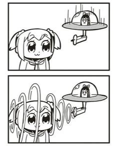
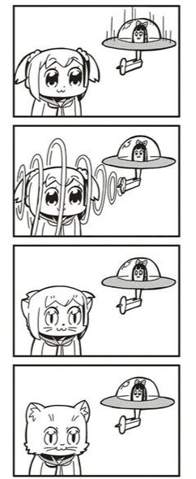

<link rel="stylesheet" href="../assets/css/slidetemplate.css">

<link rel="preconnect" href="https://fonts.googleapis.com">
<link rel="preconnect" href="https://fonts.gstatic.com" crossorigin>
<link href="https://fonts.googleapis.com/css2?family=Nunito:wght@200;500;700&family=Roboto:ital,wght@0,100;0,300;0,400;0,500;0,700;1,100&display=swap" rel="stylesheet">

<!-- _class: lead -->
# Sound, Space, and Body (SSB):  Week 3

---
## Today's Agenda

- MiniProject01: Iteration 01
- SSB: Development 
- Code → Sound: strudel workshop

---
# Playtest: 

**What** - What action/object/sound is it?
**How** - How do you do it? How do you respond? How do you feel?

Ideate: 

**Who** - Who are you designing for or with?
**Where** - In what place or situation? 
**WHAT** — What activity, behaviour, or relationship can you build upon it?

---
# What's next?

## Action -> Reaction -> [ ? ]

---
# Building up a mental model:

<iframe width="560" height="315" src="https://www.youtube.com/embed/IjOSkQY-Ar8?si=K3L8qFvJ1vEzvU_a" title="YouTube video player" frameborder="0" allow="accelerometer; autoplay; clipboard-write; encrypted-media; gyroscope; picture-in-picture; web-share" referrerpolicy="strict-origin-when-cross-origin" allowfullscreen></iframe>

---
# Yonkoma Storyboard: 

---
# 起/承/転/結:  Ki-Sho-Ten-Ketsu

- 起: **Setup**
- 承: **Development**
- 転(转): **Twist**
- 結(合): **Conclusion**

---
# Yonkoma: 

<iframe width="560" height="315" src="https://www.youtube.com/embed/C9oZ199kzs8?si=c0q4gXe_iGcWwYfZ" title="YouTube video player" frameborder="0" allow="accelerometer; autoplay; clipboard-write; encrypted-media; gyroscope; picture-in-picture; web-share" referrerpolicy="strict-origin-when-cross-origin" allowfullscreen></iframe>

---
# How can we develop further?

<!-- ### Improve the storytelling
### Improve the sound quality
### Verify input device & sound output configuration
### Extend the SoundPlayer code with new features
### Test with friends & family -->

---
# Tools & Equipment:

### DD Equipment Gallery
https://airtable.com/appn9pH3DdyrxXmJz/shrRiGVVbuboQAr04/tbl8YDasGZd83pxDb

---
# Disassemblying the Xiaomi Speaker

<iframe width="560" height="315" src="https://www.youtube.com/embed/WwlrqMIA3tg?si=wqW_6v79w7bDZ-_y" title="YouTube video player" frameborder="0" allow="accelerometer; autoplay; clipboard-write; encrypted-media; gyroscope; picture-in-picture; web-share" referrerpolicy="strict-origin-when-cross-origin" allowfullscreen></iframe>

---
# Extending the SoundPlayer code with Vibe Coding: 

- Ask the AI (Claude, Codex) for a brief prompt to reproduce the sample code.
- Review it, remove unneeded features, and add required ones.
- Request the coding.
- (If it fails multiple times, create new code with the updated prompt rather than fix the existing code.)

---
# Example Feature Additions:

- Volume: 0-100
- Pan: Left, Right, Center
- Speed: 0-100

---

<iframe width="560" height="315" src="https://www.youtube.com/embed/XndtaCsG17w?si=b-dY3g-R0Kd936yf" title="YouTube video player" frameborder="0" allow="accelerometer; autoplay; clipboard-write; encrypted-media; gyroscope; picture-in-picture; web-share" referrerpolicy="strict-origin-when-cross-origin" allowfullscreen></iframe>

---

# Next Week: Project 01 Demo

---

# Break 

---

---

# Designing Sound with Code

- How to make it more dynamic and expressive?
- How to make it more musical?
- How to make it more responsive? 

---
# Interactive Audio Programming

## Ableton Live + Midi Controller https://www.ableton.com/en/live/what-is-live/
## MAX/MSP: https://cycling74.com/
## TouchDesigner: https://derivative.ca/UserGuide/TouchDesigner

<!-- ---
## p5.js + p5.sound:  -->
<!-- 
### Learning curve is steep
### Quite hard to make it sound good & musical -->

---
# Live Coding: Algorave 

<iframe width="560" height="315" src="https://www.youtube.com/embed/S2EZqikCIfY?si=Ql3UQzE1PpVQ6hsg" title="YouTube video player" frameborder="0" allow="accelerometer; autoplay; clipboard-write; encrypted-media; gyroscope; picture-in-picture; web-share" referrerpolicy="strict-origin-when-cross-origin" allowfullscreen></iframe>

---
# Strudel: https://strudel.cc/

---
# Strudel Repl

 <iframe src="https://strudel.cc/#Ly8gQHRpdGxlIHJvbGxlciByZWVzZSB3aXRoIHNjcnViKCkKLy8gQGJ5IG1lc3RlbGEKCnNldGNwbSgxNjAvNCkKc2FtcGxlcygnZ2l0aHViOnlheHUvY2xlYW4tYnJlYWtzJykKc2FtcGxlcyh7J3JlZXNlJzonaHR0cHM6Ly9jZG4uZnJlZXNvdW5kLm9yZy9wcmV2aWV3cy8yMzYvMjM2OTMyXzQyMTI0NjItbHEubXAzJ30pCgpsZXQgc2VxMSA9ICI8IDVANSAxQDIgMUAzIDRAMSAzQDIgNkAyID4qOCIgLy8gc3RyYWlnaHQgYWhlYWQKbGV0IHNlcTIgPSAiPCAwQDMgPDAgMz5ANSAyQDMgMkAzIDRAMiA%2BKjgiIC8vIGFsdCBzbGljZXMgZXZlcnkyIGJhcnMKCmxldCBicmVhazEgPSBzKCJhbWVuOjAvNCIpICAuZml0KCkuc2NydWIoc2VxMS5kaXYoOCkpCmxldCBicmVhazIgPSBzKCJzZXNhbWU6MC8xIikuZml0KCkuc2NydWIoc2VxMi5kaXYoOCkpCmxldCBicmVhazMgPSBzKCJyaWZmaW46MC8yIikuZml0KCkuc2NydWIoc2VxMS5kaXYoOCkpCgpsZXQgcGFkcyA9IGNob3JkKCI8RTEzc3VzIF8gQTEzc3VzIF8gQzEzc3VzIF8gRzEzc3VzIF8gPiIpLnZvaWNpbmcoKQogIC5zKCdzdXBlcnNhdycpLmF0dGFjayguNSkucmVsZWFzZSguNSkKICAuZ2FpbiguNSkucm9vbSgzKS5waGFzZXIoMSkucGhhc2VyZGVwdGgoMC4zKS5wb3N0Z2FpbiguMikKLmVhcmx5KC4xKQoKbGV0IGJhc3MgPSBub3RlKCI8ZTIgXyBjIzMgXyBjMyBfIGcyIF8gPiIpLnMoJ3JlZXNlJykudHJhbnNwb3NlKC0xMikKICAvLyAuc3RydWN0KCI8MSBfIF8gIDEgXyBfIDEgXyA%2BKjgiKQogIC5zKCJyZWVzZSIpCiAgLmNsaXAoMSkKICAudmliKCIzOi40IikKICAuZGlzdG9ydCgxKQogIC5waGFzZXIoMSkKICAucGhhc2VyZGVwdGgoLjEpCiAgLmxwZigzMDApCiAgLnBvc3RnYWluKC42KQogIC5fc2NvcGUoKQokOiBwYWRzCiQ6IGJhc3MKCiQ6IGFycmFuZ2UoCls3LCBicmVhazMuY29sb3IoImJsdWUiKV0sClsxLCBicmVhazEuY29sb3IoInJlZCIpXSwKWzMsIGJyZWFrMy5jb2xvcigiYmx1ZSIpXSwKWzEsIGJyZWFrMi5jb2xvcigiZ3JlZW4iKV0sCgopLl9waWFub3JvbGwoe2xhYmVsczoxLGN5Y2xlczoyfSkK">

---
# Strudel Workshop

## First Sounds: https://strudel.cc/workshop/first-sounds/
## First Notes: https://strudel.cc/workshop/first-notes/
## First Effects: https://strudel.cc/workshop/first-effects/

---
# First Sounds:

<iframe width="560" height="315" src="https://strudel.cc/workshop/first-sounds/" title="YouTube video player" frameborder="0" allow="accelerometer; autoplay; clipboard-write; encrypted-media; gyroscope; picture-in-picture; web-share" referrerpolicy="strict-origin-when-cross-origin" allowfullscreen></iframe>

---
# First Notes:

<iframe width="560" height="315" src="https://strudel.cc/workshop/first-notes/" title="YouTube video player" frameborder="0" allow="accelerometer; autoplay; clipboard-write; encrypted-media; gyroscope; picture-in-picture; web-share" referrerpolicy="strict-origin-when-cross-origin" allowfullscreen></iframe>

--- 
# First Effects:

<iframe width="560" height="315" src="https://strudel.cc/workshop/first-effects/" title="YouTube video player" frameborder="0" allow="accelerometer; autoplay; clipboard-write; encrypted-media; gyroscope; picture-in-picture; web-share" referrerpolicy="strict-origin-when-cross-origin" allowfullscreen></iframe>

---
# Exporting Loops
https://strudel.cc/learn/faq/#how-to-record-or-export-audio

---

# Vibe-coding Strudel
https://strudel.cc/learn/faq/#can-i-use-strudel-with-aillm-tools

---
# Loading Custom Audio Samples
https://strudel.cc/learn/samples/#loading-custom-samples

---

# Lets'JAM!: https://flok.cc/s/secondary-olive-pig-b729afd0

---

# Break-out JAMs: Create a sound loop! (approx 30 seconds)

## Pianist (Chiara, Caitlin, Chloe):
https://flok.cc/s/striking-red-gamefowl-82bfedab
## Guitarists (Relyene, Nasha, Stephanie )
https://flok.cc/s/striking-red-gamefowl-82bfedab
## Dancers (Bing Jie, Himari, Valencia, Jan)
https://flok.cc/s/striking-red-gamefowl-82bfedab

---

# SSB: Strudel 4ch Player
https://editor.p5js.org/didny/full/UjwBBSL8_

---

# NEXT Week:

## Project 01 Demo:
## Special Guest Speaker:
## Sound → Space

---

# Questions?

