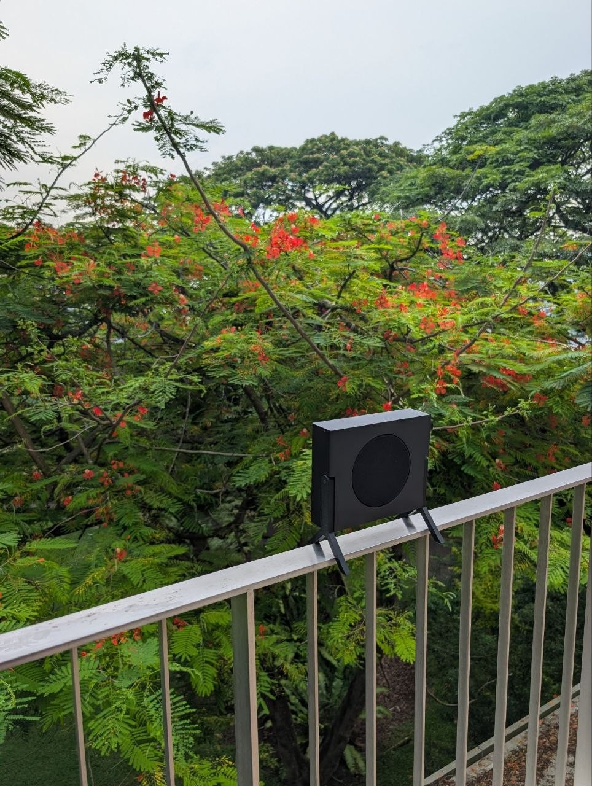
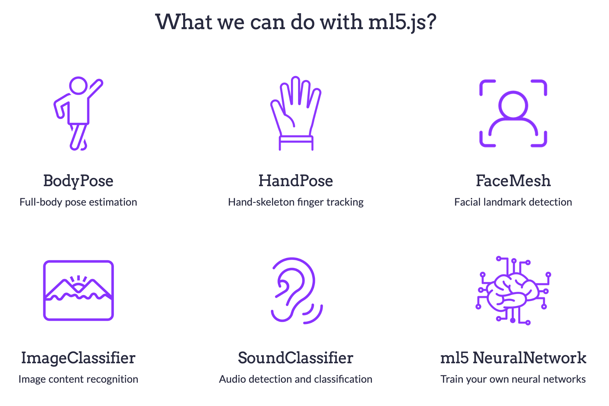

<link rel="stylesheet" href="../assets/css/slidetemplate2.css">

<link rel="preconnect" href="https://fonts.googleapis.com">
<link rel="preconnect" href="https://fonts.gstatic.com" crossorigin>
<link href="https://fonts.googleapis.com/css2?family=Nunito:wght@200;500;700&family=Roboto:ital,wght@0,100;0,300;0,400;0,500;0,700;1,100&display=swap" rel="stylesheet">

# Sound, Space, and Body (SSB):  Week 4

---
# Set up your Sound Object DEMO.

## Make sure that everything works  the way it should!

---

# Demo: Interactive Sound Object: Body -> Sound

---

# Demo Procedure

- Split into Two Group of 5 each
    - Group 1: Purple 15mins
    - Group 2: Green 15mins

- No verbal explanation; let the testers play.

---
# Feedback

1. Observe: 
    - "What is the action, what is the sound, where is it  coming from?"
    - **"How does it feel?"**
2. Describe: 
    - "When I did ___, I heard ___, and I felt ___." 
3. Exchange Ideas: 
    - "What if…"

---
### Guest Speaker

# Leon Pereira
https://www.neverinprogress.com/projects/blackbird.html

---

# Sound -> Space

# Sound as a Spatial Medium

<!-- # [Acoustic Experiment: Reverb and Echo]  
Students play back and record their musical loops through speakers of different sizes, amplification setups, and different locations of the school buildings, gaining an experiential grasp of how spatial acoustics manifest as sonic characteristics.  -->

---
# Acoustics 

<iframe width="560" height="315" src="https://www.youtube.com/embed/JPYt10zrclQ?si=3V_ro_-c2I5ya6dM" title="YouTube video player" frameborder="0" allow="accelerometer; autoplay; clipboard-write; encrypted-media; gyroscope; picture-in-picture; web-share" allowfullscreen></iframe>

---

<iframe width="560" height="315" src="https://www.youtube.com/embed/uPbq9aixozo?si=m9tJbQmhX1y7ptLx" title="YouTube video player" frameborder="0" allow="accelerometer; autoplay; clipboard-write; encrypted-media; gyroscope; picture-in-picture; web-share" referrerpolicy="strict-origin-when-cross-origin" allowfullscreen></iframe>

---
# Acoustic Control: ABCD

## A: Absorb
## B: Block
## C: Cover up
## D: Distance

---
# DEMO: Speaker Types

<!-- Demon strate different size, wattage of speakers and amplifiers. also demonstrate how reflector and  -->
---
# Selecting Speaker Cone

## Wattage (W)
## Impedance (Ω)
## Size
## Type

---
# Special Speaker Types

- Bone Conductor
https://www.youtube.com/watch?v=IS2uS_aWTHw
- Subwoofer
https://www.youtube.com/watch?v=It83KlZ61l0
- Textile Speaker
https://www.youtube.com/watch?v=9s87b2cXY_k
- Paper Speaker
https://www.youtube.com/watch?v=y1F5Gg4bG3o

---
# Draping Sound by EJTECH
https://ejtech.studio/DRAPING-SOUND

<iframe title="vimeo-player" src="https://ejtech.studio/DRAPING-SOUND" width="640" height="360" frameborder="0" referrerpolicy="strict-origin-when-cross-origin" allow="autoplay; fullscreen; picture-in-picture; clipboard-write; encrypted-media; web-share"   allowfullscreen></iframe>

---

<iframe title="vimeo-player" src="https://player.vimeo.com/video/348487065?h=ab5822b185" width="640" height="360" frameborder="0" referrerpolicy="strict-origin-when-cross-origin" allow="autoplay; fullscreen; picture-in-picture; clipboard-write; encrypted-media; web-share"   allowfullscreen></iframe>

---
# Janet Cardiff's 'The Forty Part Motet'
<iframe width="560" height="315" src="https://www.youtube.com/embed/rZXBia5kuqY?si=hOiWsfU87RnWq-C2" title="YouTube video player" frameborder="0" allow="accelerometer; autoplay; clipboard-write; encrypted-media; gyroscope; picture-in-picture; web-share" referrerpolicy="strict-origin-when-cross-origin" allowfullscreen></iframe>

---
# Cabinet of Curiosities by Janet Cardiff and George Bures Miller
<iframe width="560" height="315" src="https://www.youtube.com/embed/peOIQop5ZQw?si=YBw7hXj3Fp2pLgZu" title="YouTube video player" frameborder="0" allow="accelerometer; autoplay; clipboard-write; encrypted-media; gyroscope; picture-in-picture; web-share" referrerpolicy="strict-origin-when-cross-origin" allowfullscreen></iframe>

---
# Sound of Honda by Rhizomatiks
<iframe width="560" height="315" src="https://www.youtube.com/embed/7pC0YSdnss4?si=D4Pw3r-P326132Rq" title="YouTube video player" frameborder="0" allow="accelerometer; autoplay; clipboard-write; encrypted-media; gyroscope; picture-in-picture; web-share" referrerpolicy="strict-origin-when-cross-origin" allowfullscreen></iframe>

---
# [Hands-On] Camera as a Spatial Input

## Space Trigger
https://editor.p5js.org/didny/full/tAxP4q2Vd

## Space Region Tracker
https://editor.p5js.org/didny/full/6Uffgv6a2

---
# ml5.js   
## https://ml5js.org/

### ml5.js Hand Pose Detection
https://docs.ml5js.org/#/reference/handpose

### ml5.js Body Pose Detection
https://docs.ml5js.org/#/reference/bodypose

### ml5.js Object Detection
https://docs.ml5js.org/#/reference/object-detection

---
# ml5.js Object Detection 

### 80 Object Classes
`person, bicycle, car, motorcycle, airplane, bus, train, truck, boat, traffic light, fire hydrant, stop sign, parking meter, bench, bird, cat, dog, horse, sheep, cow, elephant, bear, zebra, giraffe, backpack, umbrella, handbag, tie, suitcase, frisbee, skis, snowboard, sports ball, kite, baseball bat, baseball glove, skateboard, surfboard, tennis racket, bottle, wine glass, cup, fork, knife, spoon, bowl, banana, apple, sandwich, orange, broccoli, carrot, hot dog, pizza, donut, cake, chair, couch, potted plant, bed, dining table, toilet, TV, laptop, mouse, remote, keyboard, cell phone, microwave, oven, toaster, sink, refrigerator, book, clock, vase, scissors, teddy bear, hair drier, toothbrush`

---

## [Hands-on]: Finding Spatial Affordance

- Form pairs

- Use a masking tape and objects to create a landmarks to guide the audience to the sound experience without looking at the screen or camera.
    - region, path, mark etc...

- Find a space in the school that enhances the sound experience.

- Find a right angle of the camera and the speaker to create a spatial sound experience triggered by the body movements.

- Record 30-60 sec video of the spatial sound experience.

---
## [Mini Project 02] Interactive Sound Environment

- Design and Create a spatial sound experience that triggered by out body movements posture or presence.

- Consider how the sound is projected and perceived by the audience.

- Create a visual or physical queue that naturally guides the audience to the sound experience.

- Demo on Week 6

