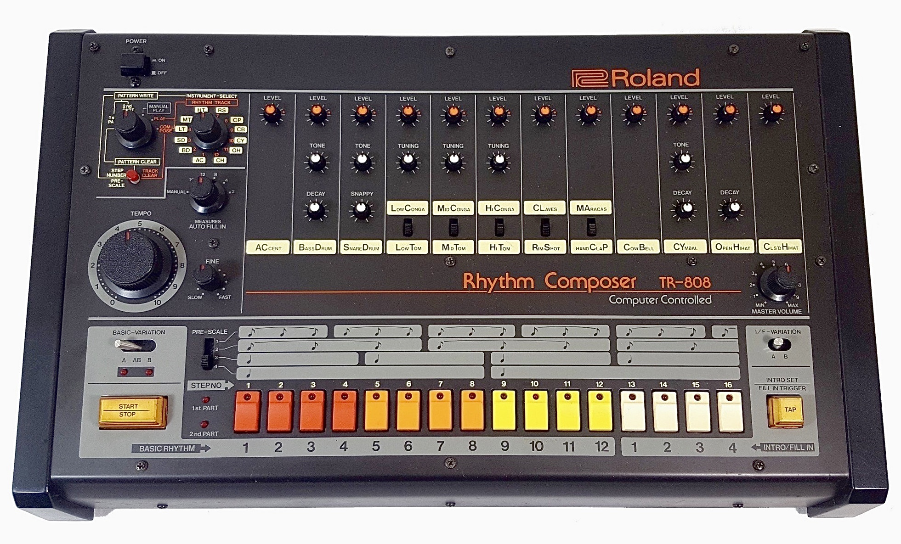

<link rel="stylesheet" href="../assets/css/slidetemplate2.css">

<link rel="preconnect" href="https://fonts.googleapis.com">
<link rel="preconnect" href="https://fonts.gstatic.com" crossorigin>
<link href="https://fonts.googleapis.com/css2?family=Nunito:wght@200;500;700&family=Roboto:ital,wght@0,100;0,300;0,400;0,500;0,700;1,100&display=swap" rel="stylesheet">


# Sound, Space, and Body (SSB): <br>Week 5

---
# Agenda

- Mapping Sound, Space & Body
- Worksession for Project02

---
# Mapping?

**INPUT SPACE → MAPPING → OUTPUT SPACE**

Examples:

- frequency → musical note
- time → rhythmic grid
- sensor value → parameter
- body position → sound

---
## We Have Already Been Mapping

Week 1-2:

**keyboard input → sound**
**body action → sound**

Week 3–4:

**body posture/ position → sound**
**sound → space**

---

# Mapping Space 

A mapping connects values in one domain to values in another.

```text
Volume(dB)           Output

0.0  ────────────→   quiet
0.5  ────────────→   medium
1.0  ────────────→   loud
```

---

# Mapping Space : 

### Frequency to Note

```text
Frequency(Hz)         Note
261.63  ───────────→   C
293.66  ───────────→   D
329.63  ───────────→   E
349.23  ───────────→   F
392.00  ───────────→   G
440.00  ───────────→   A
493.88  ───────────→   B
523.25  ───────────→   C
```

---

### Frequency to Note to MIDI Note Number

```text
Frequency(Hz)         Note         MIDI Note Number
261.63  ───────────→   C  ─────────────→  60
293.66  ───────────→   D  ─────────────→  62
329.63  ───────────→   E  ─────────────→  64
349.23  ───────────→   F  ─────────────→  65
392.00  ───────────→   G  ─────────────→  67
440.00  ───────────→   A  ─────────────→  69
493.88  ───────────→   B  ─────────────→  71
523.25  ───────────→   C  ─────────────→  72
```

---

# Mapping Types

- **discrete mapping**
- **continuous mapping**
- **categorical mapping**

---
### Continuous Value to Discrete Value

```text
Time
────────────────────────→

1/2
|-----------|-----------|

1/4
|-----|-----|-----|-----|

1/8
|--|--|--|--|--|--|--|--|


```



---
# Quantisation

https://roland50.studio/

---

# Control Mapping in Strudel

<!-- slider,freq, note, n, range, segment,  -->

- [Strudel Mapping Example 01](https://strudel.cc/#Ly8gUHJlYmFrZSBzY3JpcHQKLy8KLy8gVGhpcyBpcyBjb2RlIHRoYXQgaXMgbG9hZGVkIGJlZm9yZSB5b3VyIHBhdHRlcm4gaXMgcnVuLgovLyBZb3UgY2FuIHVzZSBpdCB0byBkZWZpbmUgY3VzdG9tIGZ1bmN0aW9ucyB0byB1c2UgaW4gYW55IHBhdHRlcm4uCi8vIAovLyBUaGlzIGlzIGFuIGluaXRpYWwgZXhhbXBsZSBzY3JpcHQuIFlvdSBjYW4gZWRpdCBpdCB0byBhZGQgCi8vIHlvdXIgb3duIGZ1bnRpb25zLgovLwovLyBUbyB1c2UgYSBzY3JpcHQgc2hhcmVkIGJ5IHNvbWUgb3RoZXIgdXNlciB5b3UgY2FuIHVzZQovLyB0aGUgaW1wb3J0LWJ1dHRvbiBvciBwYXN0ZSB0aGUgc2NyaXB0IGluIHRoaXMgZWRpdG9yLgoKY29uc3QgcmF0Y2hldCA9IHJlZ2lzdGVyKCdyYXRjaGV0JywgKHBhdCkgPT4gcGF0LnNvbWV0aW1lcyhwbHkoMikpKQoKLy8gQHRpdGxlIHN0cmFuZ2VyIG1hcHBpbmcKCnNldGNwbSgxNjAvNCk7CgpsZXQgY3V0b2ZmID0gc2xpZGVyKDEzMTcsMTAsMTAwMDAsMSk7CmxldCBlbnYgPSBzbGlkZXIoMSwxLDEwLDAuMSk7CmxldCBwR2FpbiA9ICBzbGlkZXIoMC40LDAsMiwwLjEpOwoKCnAxOiBuKCIwIDIgNCA2IDcgNiA0IDIiKQogIC5zY2FsZSgiPGMzOm1ham9yPi8yIikKICAucygic3VwZXJzYXciKQogIC5kaXN0b3J0KDAuNykKICAuc3VwZXJpbXBvc2UoKHgpID0%2BIHguZGV0dW5lKCI8MC41PiIpKQogIC8vLmxwZW52KHBlcmxpbi5zbG93KDMpLnJhbmdlKDEsIDQpKQogIAogIC5scGVudihlbnYpCiAgLmxwZihjdXRvZmYpCiAgLy8gIC5scGYocGVybGluLnNsb3coMikucmFuZ2UoMTAwLCAyMDAwKSkKICAuZ2FpbihwR2Fpbikucm9vbSguMyk7CiAKX3AyOiAiPGExIGUyPi84Ii5jbGlwKDAuNikuc3RydWN0KCJ4KjgiKS5zKCJzdXBlcnNhdyIpLm5vdGUoKS5yb29tKC4zKTsKCgo%3D)
---
# MIDI Control in strudel


```javascript
const cc = await midin('IAC Driver Bus 1')
note("c a f e").lpf(cc(0).range(0, 1000)).lpq(cc(1).range(0, 10)).sound("sawtooth")
```
---
# Mapping Space-Sound

<iframe src="https://www.youtube.com/watch?v=lNPWub-MNxg"></iframe>

---
# Mapping Body 

- Rokeby, Very Nervous System (1986–90): 
https://www.youtube.com/watch?v=qdvyuvfKVU0
- Google Creative Lab, Semi-Conductor (2018):
https://www.youtube.com/watch?v=L7lxRjJvAns

- Messa Di Voce (2003)
https://www.youtube.com/watch?v=STRMcmj-gHc
 
- Levin & Lieberman, Manual Input Sessions (2004):
https://www.youtube.com/watch?v=cWj59xTVUDY

---
# ml5.js: PoseNet

[ID2116 PoseNet Tutorial](https://clementzheng.notion.site/Week-7-PoseNet-p5-js-aff524be56e74e4a90ba095a128ea92d)

[ID2116 Mediapipe Hands Tutorial](https://clementzheng.notion.site/Week-7-Mediapipe-Hands-p5-js-b937d39d69f549d08fa8382c5fcc731b)


---
# Semantic Mapping 


---

## Teachable Machine
https://teachablemachine.withgoogle.com/train

---
<iframe src="
https://teachablemachine.withgoogle.com/train"></iframe>


---
# Neural Beatbox(Nao Tokui, 2019)
https://neuralbeatbox.net/

---
# How we visualised the sounds of Singapore with creative coding

https://www.straitstimes.com/multimedia/graphics/2024/11/sounds-sg-explainer/index.html

---
# Sound Mapping

---
# Mapping Space


---
<iframe src="https://www.youtube.com/shorts/hruJF2vSTuI"></iframe>


---
# p5.mapper

https://jdeboi.com/p5.mapper/


---
## [Mini Project 02] Interactive Sound Environment

- Design and Create a spatial sound experience that triggered by our body movements posture or presence.

- Consider how the sound is projected and perceived by the audience.

- Create a visual or physical queue that naturally guides the audience to the sound experience.

- Demo on Week 6


